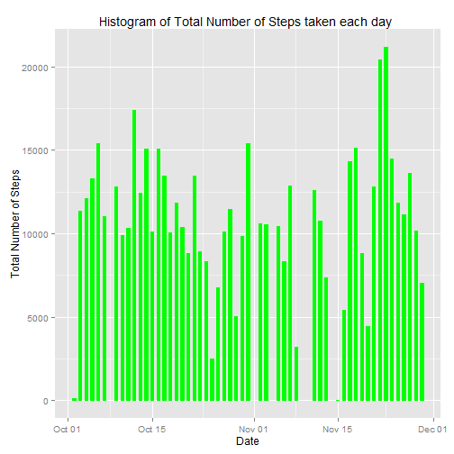
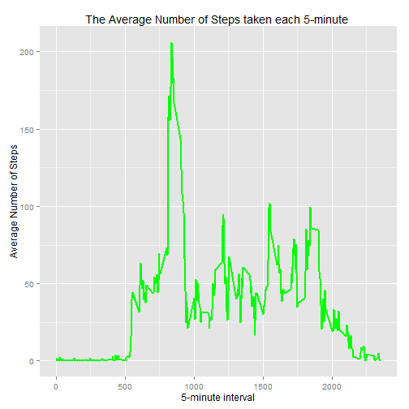
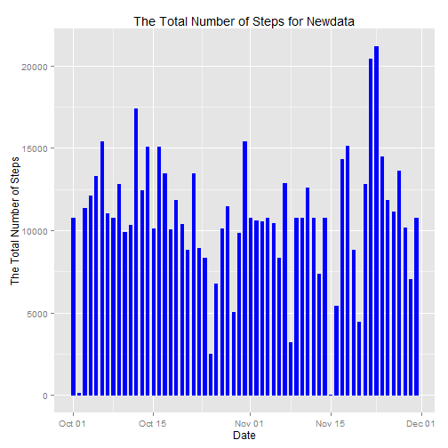
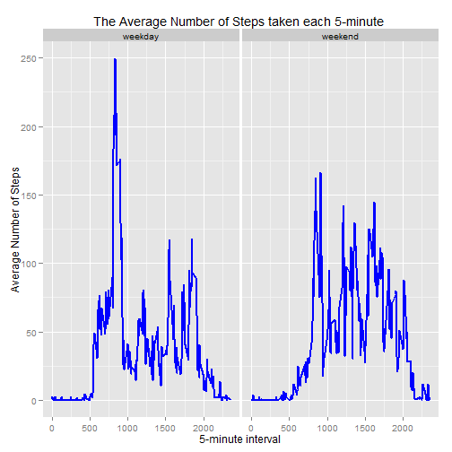

Reproducible Research : Peer Assessment 1
========================================================
Created by Trent Lin Sep.10 2014
# Basic Setting

```r
echo = TRUE # Always make code visible
options(scipen = 1) # Turn off scientific notation for numbers
```
# Loading and processing the data

```r
data <- read.csv("activity.csv")
data$date <- as.Date(x=data$date) #change format
data$month <- as.numeric(format(data$date,"%m"))
noNAdata <- na.omit(data)
head(noNAdata)
```

```
##     steps       date interval month
## 289     0 2012-10-02        0    10
## 290     0 2012-10-02        5    10
## 291     0 2012-10-02       10    10
## 292     0 2012-10-02       15    10
## 293     0 2012-10-02       20    10
## 294     0 2012-10-02       25    10
```

```r
library(ggplot2)
Sys.setlocale(category="LC_ALL",locale="English") # transfer date from Traditional Chinese to English
```

```
## [1] "LC_COLLATE=English_United States.1252;LC_CTYPE=English_United States.1252;LC_MONETARY=English_United States.1252;LC_NUMERIC=C;LC_TIME=English_United States.1252"
```
# What is mean total number of steps taken per day?
For the part of the assignment you can ignore the missing values in the dataset.
### Make a histogram of the total number of steps taken each day

```r
ggplot(noNAdata, aes(date, steps)) + geom_bar(stat = "identity", colour = "green",fill="green", width = 0.5) + labs(title= "Histogram of Total Number of Steps taken each day ", x="Date", y="Total Number of Steps")
```

 
### Calculate and report the mean and median total number of steps taken per day

mean of total steps taken per day

```r
totalsteps <- aggregate(x=noNAdata$steps,by=list(date=noNAdata$date),FUN= sum)
m <- mean(totalsteps$x)
m
```

```
## [1] 10766
```
median of total steps taken per day

```r
md <- median(totalsteps$x)
md
```

```
## [1] 10765
```
# What is the average daily activity pattern ?
### Make a time series plot(i.e. type="1") of the 5-minute interval(x-axis) and the average number of steps taken, averaged across all day (y-axis)

```r
avgsteps <- aggregate(x=noNAdata$steps,by=list(interval=noNAdata$interval),FUN= mean)
names(avgsteps)[2] <- "meansteps"
head(avgsteps)
```

```
##   interval meansteps
## 1        0   1.71698
## 2        5   0.33962
## 3       10   0.13208
## 4       15   0.15094
## 5       20   0.07547
## 6       25   2.09434
```

```r
ggplot(avgsteps, aes(interval, meansteps))+geom_line(stat = "identity", color ="green",size=1)+
  labs(title= "The Average Number of Steps taken each 5-minute ", x="5-minute interval", y="Average Number of Steps")
```

 
### Which 5-minute interval, on average across all the days in the dataset, contains the maximum number of steps ?

```r
avgsteps[avgsteps$meansteps == max(avgsteps$meansteps),]
```

```
##     interval meansteps
## 104      835     206.2
```
# Imputing missing values
###Calculate and report the total number of missing values in the dataset(i.e. the total number of rows with NAS)

```r
sum(is.na(data))
```

```
## [1] 2304
```
###2 Devise a strategy for filling in all of the missing values in the dataset.

```r
Newdata <- data
```
The strategy does not need to be sophisticated. For example, you could use the mean/median for that day, or mean for that 5-minute interval,
Here I choice to devise the mean for that 5-minute interval
### Create a new dataset that is equal to the original dataset but with the missing data filled in.

```r
for(i in 1:nrow(Newdata)){
  if(is.na(Newdata$steps[i])){
    Newdata$steps[i] <- avgsteps[Newdata$interval[i] == avgsteps$interval,]$meansteps
  }
}
head(Newdata)
```

```
##     steps       date interval month
## 1 1.71698 2012-10-01        0    10
## 2 0.33962 2012-10-01        5    10
## 3 0.13208 2012-10-01       10    10
## 4 0.15094 2012-10-01       15    10
## 5 0.07547 2012-10-01       20    10
## 6 2.09434 2012-10-01       25    10
```
### Make a histogram of the total number of steps taken each day

```r
ggplot(Newdata,aes(date,steps))+geom_bar(stat= "identity", color ="blue", fill="blue", width= 0.5)+
  labs(title="The Total Number of Steps for Newdata", x="Date", y="The Total Number of Steps")
```

 
### Calculate the mean of the total number of steps taken per day

```r
Newtotalsteps <- aggregate(x=Newdata$steps, by=list(date=Newdata$date),FUN = sum)
names(Newtotalsteps)[2] <- "steps"
head(Newtotalsteps)
```

```
##         date steps
## 1 2012-10-01 10766
## 2 2012-10-02   126
## 3 2012-10-03 11352
## 4 2012-10-04 12116
## 5 2012-10-05 13294
## 6 2012-10-06 15420
```

```r
Newm <- mean(Newtotalsteps$steps)
Newm
```

```
## [1] 10766
```
### Calculate the median of the total number of steps taken per day

```r
Newmd <- median(Newtotalsteps$steps)
Newmd
```

```
## [1] 10766
```
### Do these values differ from the estimates from the first part of the assignment ?
Yes

### What is the impact of imputing missing data on the estimates of the total daily number of steps?

```r
Newm - m
```

```
## [1] 0
```

```r
Newmd -md
```

```
## [1] 1.189
```
So after imputing the missing value the mean of the total number of steps taken per day is the same, the median of imputing the missing value is greater.

# Are there differences in activity patterns between weekdays and weekends?
### Create a new factor variable in the dataset with two levels-"weekday" and weekend" indicating whether a given date is a weekday or weekend day.

```r
head(Newdata)
```

```
##     steps       date interval month
## 1 1.71698 2012-10-01        0    10
## 2 0.33962 2012-10-01        5    10
## 3 0.13208 2012-10-01       10    10
## 4 0.15094 2012-10-01       15    10
## 5 0.07547 2012-10-01       20    10
## 6 2.09434 2012-10-01       25    10
```

```r
Newdata$weekdays <- as.factor(format(Newdata$date,"%A"))
levels(Newdata$weekdays)
```

```
## [1] "Friday"    "Monday"    "Saturday"  "Sunday"    "Thursday"  "Tuesday"  
## [7] "Wednesday"
```

```r
levels(Newdata$weekdays) <- list(weekday=c("Monday","Thesday","Wednesday","Thursday","Friday"),
                                 weekend=c("Saturday","Sunday"))
levels(Newdata$weekdays)
```

```
## [1] "weekday" "weekend"
```

```r
head(Newdata)
```

```
##     steps       date interval month weekdays
## 1 1.71698 2012-10-01        0    10  weekday
## 2 0.33962 2012-10-01        5    10  weekday
## 3 0.13208 2012-10-01       10    10  weekday
## 4 0.15094 2012-10-01       15    10  weekday
## 5 0.07547 2012-10-01       20    10  weekday
## 6 2.09434 2012-10-01       25    10  weekday
```
### Make a panel plot containing a time series plot(i.e.type="1") of the 5-minute interval(x-axis) and the average number of step taken,averaged across all weekday days or weekend days (y-axis)

```r
Newavgsteps <- aggregate(x=Newdata$steps,by=list(interval=Newdata$interval,weekdays=Newdata$weekdays),FUN= mean)
names(Newavgsteps)[3] <- "meansteps"
head(Newavgsteps)
```

```
##   interval weekdays meansteps
## 1        0  weekday   2.81394
## 2        5  weekday   0.55660
## 3       10  weekday   0.21646
## 4       15  weekday   0.24738
## 5       20  weekday   0.01258
## 6       25  weekday   1.62683
```

```r
ggplot(Newavgsteps, aes(interval, meansteps))+geom_line(stat = "identity", color ="blue",size=1)+
  facet_grid(. ~ weekdays, scales = "free")+
  labs(title= "The Average Number of Steps taken each 5-minute ", x="5-minute interval", y="Average Number of Steps")
```

 
